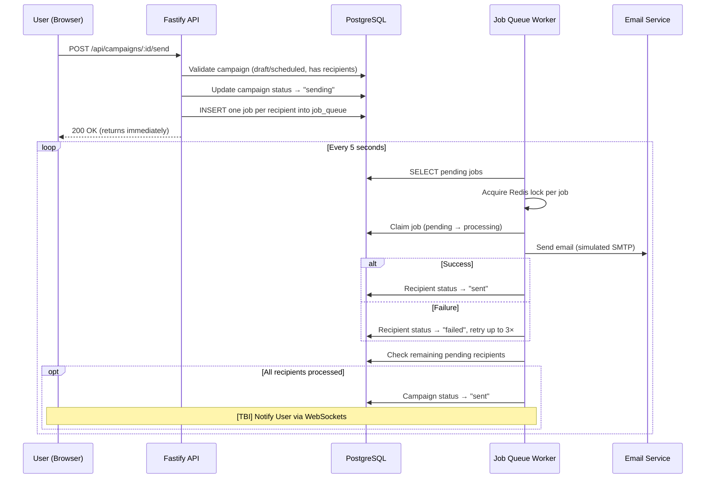

# Mini Campaign Manager

A full-stack email campaign management application built with a monorepo architecture. Create, schedule, and send email campaigns with real-time delivery tracking and statistics.

## Tech Stack

| Layer        | Technology                                                     |
| ------------ | -------------------------------------------------------------- |
| **Frontend** | React 19, Vite 8, TailwindCSS 4, Redux Toolkit, TanStack Query |
| **Backend**  | Node.js, Fastify 5, Knex.js (query builder), Zod               |
| **Database** | PostgreSQL 16                                                  |
| **Cache**    | Redis 7 (job queue, distributed locks)                         |
| **Shared**   | TypeScript types, Zod schemas, constants                       |
| **Monorepo** | Nx, npm workspaces                                             |
| **Icons**    | Lucide React                                                   |

### Key Patterns

- **Background Workers**: `toad-scheduler` runs two periodic tasks:
    - **Job Queue Worker** (every 5s) — processes email-sending jobs from the `job_queue` table
    - **Campaign Scheduler** (every 10s) — polls for scheduled campaigns past their `scheduled_at` time and triggers sending
- **Distributed Locking**: Redis-based locks prevent duplicate processing in multi-instance deployments
- **Type-safe DB**: Knex module augmentation provides compile-time column validation for all queries

## Prerequisites

- **Node.js** >= 18
- **npm** >= 9
- **Docker** & **Docker Compose** (for PostgreSQL & Redis)

## Send Campaign Flow

When a user clicks **"Send Now"**, the following async pipeline executes:



**Step-by-step breakdown:**

1. **API validates & enqueues** — The `POST /api/campaigns/:id/send` endpoint validates the campaign (must be `draft` or `scheduled`, must have ≥1 recipient), transitions the status to `sending`, and bulk-inserts one job per recipient into the `job_queue` table. The API returns immediately — no email is sent in the request cycle.

2. **Worker picks up jobs** — The background worker polls the `job_queue` table every 5 seconds, fetching up to 30 pending jobs (`POOL_SIZE`) but processing at most 10 per tick (`BATCH_SIZE`). Each job is protected by a Redis distributed lock to prevent duplicate processing across multiple worker instances.

3. **Handler sends email** — For each job, the `send-campaign.handler` fetches the campaign content and recipient email, then calls the `EmailService` to deliver the message. On success, the recipient's status is updated to `sent`. On failure, the job is marked `failed` and retried up to 3 times with a 30-second cooldown.

4. **Campaign completes** — After each recipient is processed, the handler checks if any `pending` recipients remain. When the count reaches 0, the campaign status transitions from `sending` to `sent`, making it read-only with full delivery statistics.

5. **Real-time Notification (To Be Implemented)** — Once the campaign status is updated to `sent`, a message will be broadcast via WebSockets to the active user session, triggering a success toast in the frontend.

## Getting Started

### 1. Install dependencies

```bash
npm install
```

### 2. Start application

```bash
docker-compose up --build
```

You application will be started at: http://localhost:5174/

### 3. Setup environment

```bash
cp packages/backend/.env.example packages/backend/.env
```

- Update to correct variables if need

### 4. Run database migrations & seed

```bash
npm run db:migrate
npm run db:seed
```

Seed creates a demo user and sample campaigns:

- **Email:** `admin@example.com`
- **Password:** `password123`

### 5. Run in development mode

```bash
# Run both backend & frontend simultaneously
npm run dev

# Or run separately:
npm run dev:backend
npm run dev:frontend
```

## All Available Commands

### Development

| Command                | Description                       |
| ---------------------- | --------------------------------- |
| `npm run dev`          | Start backend + frontend together |
| `npm run dev:backend`  | Start backend only (port 3001)    |
| `npm run dev:frontend` | Start frontend only (port 5173)   |

### Build

| Command                  | Description                             |
| ------------------------ | --------------------------------------- |
| `npm run build`          | Build all packages                      |
| `npm run build:backend`  | Build backend (`tsc` → `dist/`)         |
| `npm run build:frontend` | Build frontend (`vite build` → `dist/`) |

### Production

| Command                    | Description                                |
| -------------------------- | ------------------------------------------ |
| `npm run start:backend`    | Start built backend (`node dist/index.js`) |
| `npm run preview:frontend` | Preview built frontend (Vite preview)      |

### Database

| Command                   | Description                  |
| ------------------------- | ---------------------------- |
| `npm run db:migrate`      | Run database migrations      |
| `npm run db:migrate:down` | Rollback last migration      |
| `npm run db:seed`         | Seed database with demo data |

### Testing

| Command        | Description            |
| -------------- | ---------------------- |
| `npm run test` | Run backend test suite |

## Project Structure

```
mini-campaign-manager/
├── packages/
│   ├── backend/                   # Fastify API server
│   │   └── src/
│   │       ├── config/            # Environment config (env.ts)
│   │       ├── controllers/       # Route handlers (auth, campaign, recipient)
│   │       ├── db/                # Connection, migrations, seed, Knex types
│   │       ├── job-queue/         # Job dispatcher & handlers
│   │       ├── middleware/        # Auth (JWT) & Zod validation
│   │       ├── redis/             # Redis client & distributed lock
│   │       ├── services/          # Business logic layer
│   │       └── workers/           # Background job & scheduler workers
│   ├── frontend/                  # React SPA
│   │   └── src/
│   │       ├── api/               # Axios API client & endpoints
│   │       ├── components/        # Reusable UI (Layout, Cards, Dialogs, etc.)
│   │       ├── hooks/             # Custom hooks (auth, campaigns, theme)
│   │       ├── pages/             # Page components (Login, Register, Campaigns)
│   │       ├── store/             # Redux slices (auth, campaign)
│   │       └── styles/            # Global CSS & design tokens
│   └── shared/                    # Shared across all packages
│       └── src/
│           ├── types/             # TypeScript interfaces
│           ├── schemas/           # Zod validation schemas
│           └── constants/         # Shared constants
├── docker-compose.dev.yml
├── nx.json
└── tsconfig.base.json
```

## API Endpoints

### Auth

| Method | Endpoint             | Description               |
| ------ | -------------------- | ------------------------- |
| POST   | `/api/auth/register` | Register new user         |
| POST   | `/api/auth/login`    | Login and receive JWT     |
| GET    | `/api/auth/me`       | Get current user (authed) |

### Campaigns (requires JWT)

| Method | Endpoint                      | Description                                  |
| ------ | ----------------------------- | -------------------------------------------- |
| GET    | `/api/campaigns`              | List campaigns (paginated, filter by status) |
| GET    | `/api/campaigns/:id`          | Get campaign detail with recipients          |
| GET    | `/api/campaigns/:id/stats`    | Get campaign delivery statistics             |
| POST   | `/api/campaigns`              | Create new campaign                          |
| PUT    | `/api/campaigns/:id`          | Update draft campaign                        |
| DELETE | `/api/campaigns/:id`          | Delete draft campaign                        |
| POST   | `/api/campaigns/:id/schedule` | Schedule campaign for future send            |
| POST   | `/api/campaigns/:id/send`     | Send campaign immediately (simulated)        |

### Recipients (requires JWT)

| Method | Endpoint               | Description            |
| ------ | ---------------------- | ---------------------- |
| GET    | `/api/recipients`      | List recipients        |
| POST   | `/api/recipients`      | Create recipient       |
| POST   | `/api/recipients/bulk` | Bulk create recipients |
| DELETE | `/api/recipients/:id`  | Delete recipient       |

### Health

| Method | Endpoint      | Description  |
| ------ | ------------- | ------------ |
| GET    | `/api/health` | Health check |

## Campaign Status Flow

```
  ┌─────────────────────────────┐
  │                             │
  ▼                             │
draft ──── schedule ───► scheduled ──── auto-trigger ───► sending ───► sent
  │                                                                     ▲
  └──────────────── send directly ──────────────────────────────────────┘
```

| Status        | Description                                            |
| ------------- | ------------------------------------------------------ |
| **Draft**     | Can edit, delete, schedule, or send directly           |
| **Scheduled** | Awaiting `scheduled_at` time; auto-triggered by worker |
| **Sending**   | Emails being dispatched via background job queue       |
| **Sent**      | Complete — read-only with delivery statistics          |

## How I Used Claude Code

### 1. What Tasks I Delegated to Claude Code

I used Claude Code as a pair-programming partner throughout the development of this project. The main tasks I delegated:

- **Environment validation** — Asked Claude Code to add Zod-based runtime validation for all environment variables in `env.ts`, so the app fails fast with clear errors on misconfiguration instead of silently using invalid values.
- **Unit test expansion** — Had Claude Code generate additional test cases for campaign status transitions, send-campaign logic, and recipient management to improve test coverage.
- **UI component refactoring** — Delegated the extraction of a reusable `CampaignForm` component from `CampaignNewPage` and `CampaignDetailPage`, including recipient selection logic shared between creation and editing flows.
- **Backend API updates with frontend sync** — When I changed the campaign stats response format (`open_rate`, `send_rate`, `failed`), Claude Code updated both the backend service and all consuming frontend components in one pass.
- **Dialog animations** — Asked Claude Code to implement smooth open/close CSS animations for `ConfirmDialog` and `ScheduleDialog`, including backdrop transitions and proper lifecycle management with `onAnimationEnd`.
- **Bug investigation** — Pointed Claude Code at the job queue worker output showing 30 jobs processed per tick when `BATCH_SIZE` was 10, and had it trace the root cause and fix it.

### 2. Real Prompts I Used

**Prompt 1 — Environment validation:**

> _"Please use Zod to validate these environment variables for me. If any of them have incorrect types, the app should throw an error immediately."_

This was a simple but effective delegation. Claude Code generated a Zod schema for all env vars with proper type coercion and threw at startup if validation failed.

**Prompt 2 — Reusable form refactoring:**

> _"Please take another look. I think the edit and create flows can reuse the same component from the campaign new page. Because we also allow users to update recipients during editing."_

I identified the duplication pattern and pointed Claude Code at both files. It created a shared `CampaignForm` component with `initialData` prop support and integrated it into both pages.

**Prompt 3 — Debugging batch processing:**

> _"Please help me check for this one, batch size is 10 but it ran 30 items in a tick?"_

I pasted the terminal output and pointed at the relevant code. Claude Code traced the issue to the `for` loop iterating through the entire `POOL_SIZE` (30) without a break condition after reaching `BATCH_SIZE` (10) successful jobs.

### 3. Where Claude Code Was Wrong or Needed Correction

- **Typo in generated code:** When generating the inline edit form for `CampaignDetailPage`, Claude Code used `setForm(...)` instead of the correct `setEditData(...)` in one of the `onChange` handlers. This would have caused a runtime error — I caught it during code review before it shipped.

- **Overly complex batch fix:** The first attempt at fixing the job queue batch bug used a convoluted expression: `pool.slice(i, i + Math.min(BATCH_SIZE, remaining + BATCH_SIZE))`. I had Claude Code simplify it to a straightforward `if (processed >= BATCH_SIZE) break;` after the inner loop — cleaner and easier to reason about.

- **Replacement target mismatches:** When editing `CampaignDetailPage`, Claude Code occasionally had inaccuracies in its target content for find-and-replace operations, requiring it to re-read the file and retry. This is a common issue with large files where Claude Code works from truncated context.

### 4. What I Would Not Let Claude Code Do — and Why

- **Architecture decisions for email sending** — Claude Code's initial approach was to update campaign recipient statuses to `sent` synchronously when the user clicked "Send" in the API handler. In a real product, combining email delivery and status updates in a single API call is a bad pattern — it blocks the response, doesn't scale, and fails ungracefully. I redesigned the approach to use a **job queue**: the API only enqueues jobs, and background workers process them asynchronously with retry logic and distributed locking. I defined the workflow, explained the architecture to Claude Code, and had it implement each piece (job table, dispatcher, worker, handler) step by step following my instructions.

- **React Query cache key design** — I manually changed query keys from `['campaigns', id]` to `['campaign', id]` to separate single-campaign queries from list queries. Cache invalidation strategy is a core architectural decision that affects data freshness across the entire app — I wanted full control over this.

- **Git commit decisions** — I managed all git operations myself (`git add`, `git commit`). I want to control what gets committed together and write my own commit messages that reflect my understanding of the changes, not an AI-generated summary.

- **Code formatting and style cleanup** — I manually reformatted `CampaignCard.tsx` (line breaks, JSX structure) and removed unused imports like `BarChart3` from `CampaignDetailPage`. These are minor but I prefer my own formatting conventions to be consistent.

- **Infrastructure and deployment configuration** — Docker Compose setup, port assignments, and database credentials were all my decisions. These affect the local development environment for everyone on the team and need to match existing infrastructure conventions.

## License

MIT
